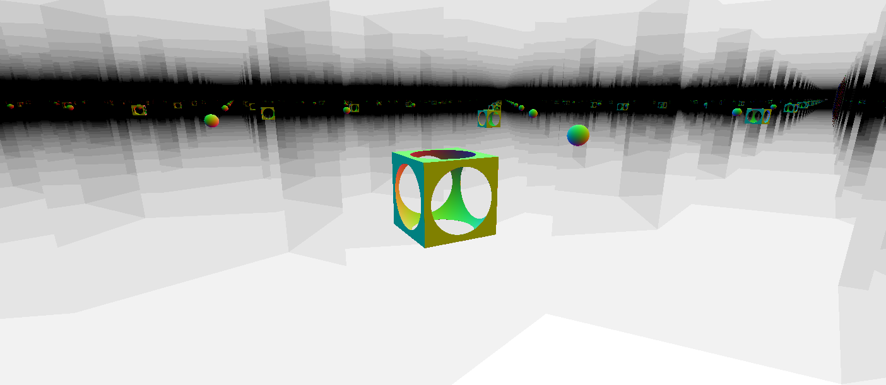

# Ray Marching Maze Demo

An interactive 3D maze visualized using ray marching techniques with Three.js and WebGL shaders.



## Features

- First-person navigation through a 3D maze
- Real-time ray marching rendering
- Collision detection and response
- Mouse look and keyboard movement controls
- WebGL shader-based rendering

## Live Demo

Check out the live demo: [under construction]

## Controls

- **WASD** - Move forward/backward/left/right
- **Mouse** - Look around
- **Space/Shift** - Move up/down
- **Click** - Lock/unlock mouse cursor

## Running Locally

### Prerequisites

- [Node.js](https://nodejs.org/) (v14 or newer)
- npm (comes with Node.js)

### Installation

1. Clone this repository:
   ```bash
   git clone https://github.com/FabianLander/RayMarchingFlatSurfaces.git
   cd ray-marching-maze
   ```

2. Install dependencies:
   ```bash
   npm install
   ```

### Development

Run the development server:

```bash
npm run dev
```

This will start a local development server at http://localhost:5173 (or another port if 5173 is already in use). The page will automatically reload when you make changes to the code.

### Building for Production

To build the project for production:

```bash
npm run build
```

This creates a `dist` folder with the compiled and optimized files ready for deployment.

To preview the production build locally:

```bash
npm run preview
```

## How It Works

This project demonstrates ray marching, an advanced rendering technique that works by:

1. Sending rays from the camera through each pixel
2. Using signed distance functions (SDFs) to define the geometry
3. Marching along each ray until it hits an object or reaches its maximum distance
4. Calculating lighting, colors, and effects based on the hit point

The entire 3D maze is defined mathematically in the fragment shader, rather than with traditional polygon meshes.

## Technologies Used

- [Three.js](https://threejs.org/) - 3D JavaScript library
- [WebGL](https://developer.mozilla.org/en-US/docs/Web/API/WebGL_API) - Web Graphics Library
- [Vite](https://vitejs.dev/) - Frontend build tool
- GLSL - OpenGL Shading Language for writing shaders

## License

[MIT](LICENSE)

## Acknowledgments

- Inspired by various ray marching tutorials and demos
- Built with Three.js and WebGL